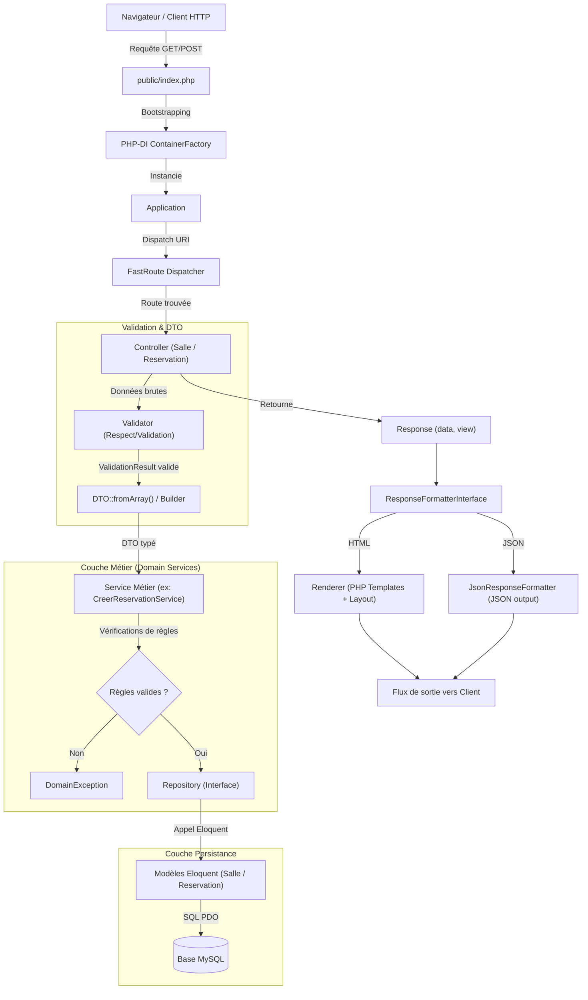
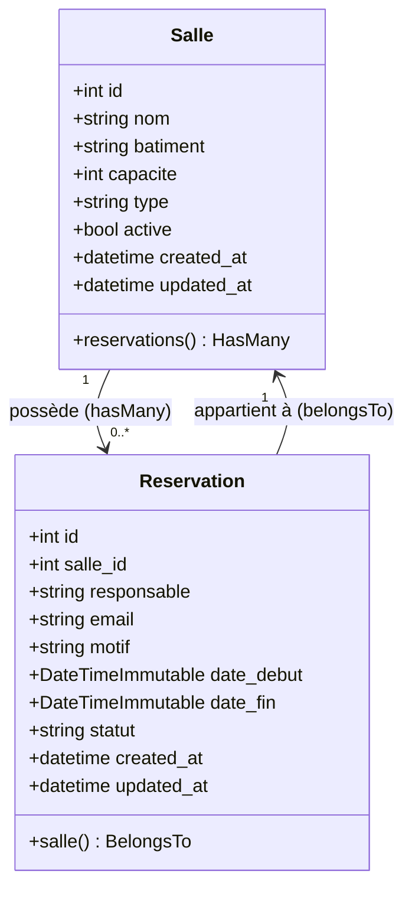

# 📘 DevLog & Documentation Technique — Gestion des Réservations de Salles

Bienvenue dans le **DevLog technique** du projet **Gestion des Réservations de Salles Universitaires**.  
Ce document a pour vocation d'expliquer en profondeur le fonctionnement interne de l'application, les choix d'architecture logicielle, le découpage en couches, les design patterns mis en œuvre ainsi que l'ensemble des fonctionnalités métier.

---

## 📑 Sommaire

1. [Vue d'ensemble et Philosophie du Projet](#1-vue-densemble-et-philosophie-du-projet)
2. [Architecture Globale et Design Patterns](#2-architecture-globale-et-design-patterns)
3. [Modèle de Données et Persistance](#3-modèle-de-données-et-persistance)
4. [Cycle de Vie d'une Requête HTTP](#4-cycle-de-vie-dune-requête-http)
5. [Exploration Détaillée du Code par Couche](#5-exploration-détaillée-du-code-par-couche)
   - [5.1 Point d'entrée et Injection de Dépendances (`config/` & `public/`)](#51-point-dentrée-et-injection-de-dépendances)
   - [5.2 Le Noyau Applicatif et Routage (`src/Application.php` & `routes/`)](#52-le-noyau-applicatif-et-routage)
   - [5.3 Contrôleurs (`src/Controller/`)](#53-contrôleurs)
   - [5.4 Validation des Données (`src/Validation/`)](#54-validation-des-données)
   - [5.5 Objets de Transfert de Données & Builders (`src/DTO/`)](#55-objets-de-transfert-de-données--builders)
   - [5.6 Services Métier et Règles de Gestion (`src/Service/` & `src/Exception/`)](#56-services-métier-et-règles-de-gestion)
   - [5.7 Couche d'Accès aux Données (`src/Repository/`)](#57-couche-daccès-aux-données)
   - [5.8 Couche de Présentation & Formatage (`src/View/` & `templates/`)](#58-couche-de-présentation--formatage)
6. [Fonctionnalités Utilisateur](#6-fonctionnalités-utilisateur)
7. [Stratégie de Tests et Qualité Logicielle](#7-stratégie-de-tests-et-qualité-logicielle)
8. [Environnement, Commandes et Déploiement](#8-environnement-commandes-et-déploiement)

---

## 1. Vue d'ensemble et Philosophie du Projet

L'application est un système web orienté objet permettant de gérer un parc de salles de cours, laboratoires, amphithéâtres et salles de réunion au sein d'une université, ainsi que la réservation de ces créneaux par des enseignants ou responsables.

### Philosophie de conception

Contrairement à une approche utilisant un framework "full-stack" tout-en-un (comme un Laravel complet ou Symfony), ce projet est conçu **from scratch** selon les principes de l'**architecture en couches (Layered Architecture)** et des principes **SOLID**, en intégrant des briques open-source autonomes reconnues de l'écosystème PHP :

* **[Eloquent ORM (`illuminate/database`)](https://github.com/illuminate/database)** : pour le mapping objet-relationnel et les requêtes SQL, utilisé hors Laravel via `Capsule\Manager`.
* **[FastRoute (`nikic/fast-route`)](https://github.com/nikic/FastRoute)** : routeur HTTP ultra-rapide basé sur des expressions régulières compilées.
* **[PHP-DI (`php-di/php-di`)](https://php-di.org/)** : conteneur d'inversion de contrôle (IoC) et injection de dépendances par autowiring.
* **[Respect/Validation (`respect/validation`)](https://respect-validation.readthedocs.io/)** : moteur de validation déclaratif et fluide.
* **[PHP dotenv (`vlucas/phpdotenv`)](https://github.com/vlucas/phpdotenv)** : gestion des variables d'environnement via fichier `.env`.
* **[PHPUnit (`phpunit/phpunit`)](https://phpunit.de/)** : suite de tests automatisés (unitaires et d'intégration).

---

## 2. Architecture Globale et Design Patterns

### Vue d'ensemble des couches

L'arborescence suit une séparation stricte des responsabilités :

```text
src/
├── Application.php              # Noyau de dispatch et d'exécution HTTP
├── Controller/                  # Réception des requêtes HTTP, orchestration
│   ├── AbstractController.php
│   ├── ReservationController.php
│   └── SalleController.php
├── DTO/                         # Objets de transfert de données immuables & Builders
│   ├── CreerReservationDTO.php
│   ├── CreerReservationDTOBuilder.php
│   ├── CreerSalleDTO.php
│   └── CreerSalleDTOBuilder.php
├── Exception/                   # Exceptions métier du domaine
│   ├── ReservationIntrouvableException.php
│   ├── ReservationInvalideException.php
│   └── SalleIndisponibleException.php
├── Model/                       # Entités Eloquent (Salle, Reservation)
│   ├── Reservation.php
│   └── Salle.php
├── Repository/                  # Contrats d'accès aux données (Interfaces & Implémentations)
│   ├── ReservationRepositoryInterface.php
│   ├── ReservationRepository.php
│   ├── SalleRepositoryInterface.php
│   └── SalleRepository.php
├── Service/                     # Logique métier pure (règles de gestion)
│   ├── AnnulerReservationService.php
│   └── CreerReservationService.php
├── Validation/                  # Règles de validation Respect/Validation
│   ├── ReservationValidator.php
│   ├── SalleValidator.php
│   └── ValidationResult.php
└── View/                        # Moteur de template, formatage HTML/JSON
    ├── Renderer.php
    ├── Response.php
    ├── ResponseFormatterInterface.php
    ├── HtmlResponseFormatter.php
    └── JsonResponseFormatter.php
```

### Diagramme de flux d'une requête



### Design Patterns Clés

1. **Front Controller Pattern** : Tout le trafic HTTP converge vers [public/index.php](file:///home/aicha/Bureau/HERITAGE/gestion_reservation_salle/public/index.php), qui initialise l'application et délègue au noyau [Application.php](file:///home/aicha/Bureau/HERITAGE/gestion_reservation_salle/src/Application.php).
2. **Inversion of Control (IoC) & Dependency Injection** : Les classes ne créent pas leurs dépendances directement avec `new`. Elles déclarent leurs besoins dans le constructeur. [PHP-DI](file:///home/aicha/Bureau/HERITAGE/gestion_reservation_salle/config/container.php) injecte automatiquement les implémentations conformes aux interfaces.
3. **Repository Pattern** : Séparation stricte entre la logique métier et l'accès aux données. Les services dépendent de `SalleRepositoryInterface` et `ReservationRepositoryInterface`, ce qui permet d'utiliser des doublures en mémoire ([InMemoryReservationRepository](file:///home/aicha/Bureau/HERITAGE/gestion_reservation_salle/tests/Unit/Service/Stub/InMemoryReservationRepository.php)) pour les tests unitaires sans base de données.
4. **Builder Pattern & DTO** : [CreerReservationDTOBuilder](file:///home/aicha/Bureau/HERITAGE/gestion_reservation_salle/src/DTO/CreerReservationDTOBuilder.php) garantit une instanciation progressive, typée et sûre des objets de transfert immuables.
5. **Strategy / Formatter Pattern** : [ResponseFormatterInterface](file:///home/aicha/Bureau/HERITAGE/gestion_reservation_salle/src/View/ResponseFormatterInterface.php) permet de basculer l'affichage de l'application entre rendu HTML et réponse JSON sans modifier une seule ligne des contrôleurs.

---

## 3. Modèle de Données et Persistance

### Diagramme Entité-Relation



### Détail des Tables MySQL

#### Table `salles`
* `id` : Clé primaire auto-incrémentée (`BIGINT UNSIGNED`).
* `nom` : Nom de la salle (`VARCHAR 100`).
* `batiment` : Bâtiment d'accueil (`VARCHAR 100`).
* `capacite` : Nombre maximal de places (`INT`, entre 1 et 1000).
* `type` : Énumération (`cours`, `informatique`, `laboratoire`, `amphitheatre`, `reunion`).
* `active` : Statut d'activation booléen (`BOOLEAN`, défaut `true`). Une salle inactive ne peut pas être réservée.
* `created_at`, `updated_at` : Horodatages automatiques gérés par Eloquent.

#### Table `reservations`
* `id` : Clé primaire auto-incrémentée (`BIGINT UNSIGNED`).
* `salle_id` : Clé étrangère pointant vers `salles(id)` (`foreignId`).
* `responsable` : Nom complet du demandeur (`VARCHAR 120`).
* `email` : Adresse e-mail du responsable (`VARCHAR 120`).
* `motif` : Motif ou raison de la réservation (`VARCHAR 255`).
* `date_debut` : Date et heure de début du créneau (`DATETIME`).
* `date_fin` : Date et heure de fin du créneau (`DATETIME`).
* `statut` : Énumération (`confirmee`, `annulee`).
* `created_at`, `updated_at` : Horodatages automatiques gérés par Eloquent.

### Idempotence des Migrations et Seeds

* **Migrations ([database/migrations/](file:///home/aicha/Bureau/HERITAGE/gestion_reservation_salle/database/migrations/))** : Avant toute opération de création, le script vérifie `$capsule->schema()->hasTable('...')` pour éviter les erreurs d'exécution multiple.
* **Seeder ([database/seed.php](file:///home/aicha/Bureau/HERITAGE/gestion_reservation_salle/database/seed.php))** : Utilise `Salle::firstOrCreate(['nom' => $data['nom']], [...])`. Si la salle existe déjà, elle n'est pas recréée.

---

## 4. Cycle de Vie d'une Requête HTTP

Voici le déroulement pas-à-pas lors d'une requête vers l'application :

1. **Point d'entrée unique** :
   Le serveur web (Apache ou `php -S`) redirige toutes les requêtes vers [public/index.php](file:///home/aicha/Bureau/HERITAGE/gestion_reservation_salle/public/index.php).
2. **Chargement de l'environnement** :
   `vlucas/phpdotenv` charge le fichier `.env` pour définir la configuration (base de données, format de réponse).
3. **Conteneur d'injection** :
   [ContainerFactory::create()](file:///home/aicha/Bureau/HERITAGE/gestion_reservation_salle/config/ContainerFactory.php) compile les définitions de [config/container.php](file:///home/aicha/Bureau/HERITAGE/gestion_reservation_salle/config/container.php).
4. **Exécution du noyau** :
   Le conteneur résout l'instance singleton de [Application](file:///home/aicha/Bureau/HERITAGE/gestion_reservation_salle/src/Application.php) et appelle sa méthode `run()`.
5. **Routage FastRoute** :
   L'URL et la méthode HTTP sont analysées par `Dispatcher::dispatch($method, $uri)`.
   - **Route inconnue** : Code HTTP 404 renvoyé avec affichage de `templates/error/404.php`.
   - **Méthode non autorisée** : Code HTTP 405 renvoyé avec l'en-tête `Allow: GET, POST` et template `templates/error/405.php`.
   - **Route trouvée** : Le contrôleur et sa méthode cible sont identifiés.
6. **Résolution dynamique des paramètres par Réflexion** :
   Dans [Application.php](file:///home/aicha/Bureau/HERITAGE/gestion_reservation_salle/src/Application.php), une instance de `\ReflectionMethod` analyse les arguments attendus par la méthode du contrôleur (par exemple `int $id`) et cast automatiquement la variable de route.
7. **Retour du contrôleur** :
   Le contrôleur retourne un objet [Response](file:///home/aicha/Bureau/HERITAGE/gestion_reservation_salle/src/View/Response.php) contenant les données (`data`) et le chemin du template (`view`).
8. **Formatage & Émission** :
   Le [ResponseFormatterInterface](file:///home/aicha/Bureau/HERITAGE/gestion_reservation_salle/src/View/ResponseFormatterInterface.php) actif transforme cet objet en HTML stylisé (avec layout et messages flash) ou en JSON selon `APP_RESPONSE_FORMAT`.

---

## 5. Exploration Détaillée du Code par Couche

### 5.1 Point d'entrée et Injection de Dépendances

#### `config/container.php`
Ce fichier est le cœur de la configuration de l'inversion de contrôle :
* Il lie les interfaces aux implémentations concrètes :
  * `SalleRepositoryInterface` $\rightarrow$ `SalleRepository`
  * `ReservationRepositoryInterface` $\rightarrow$ `ReservationRepository`
  * `SalleValidatorInterface` $\rightarrow$ `SalleValidator`
  * `ReservationValidatorInterface` $\rightarrow$ `ReservationValidator`
* Il instancie `Capsule\Manager` via une factory qui initialise Eloquent une seule fois.
* Il instancie `FastRoute\simpleDispatcher` avec les définitions de `routes/web.php`.
* Il configure dynamiquement le formateur de réponse :
  ```php
  ResponseFormatterInterface::class => factory(
      function ($container): ResponseFormatterInterface {
          $format = $_ENV['APP_RESPONSE_FORMAT'] ?? 'html';
          return $format === 'json'
              ? $container->get(JsonResponseFormatter::class)
              : $container->get(HtmlResponseFormatter::class);
      }
  )
  ```

---

### 5.2 Le Noyau Applicatif et Routage

#### `routes/web.php`
Les routes de l'application sont déclarées de manière explicite :

| Méthode | URI | Action du Contrôleur | Description |
| :--- | :--- | :--- | :--- |
| `GET` | `/` ou `/salles` | `SalleController::index` | Liste paginée du parc de salles |
| `GET` | `/salles/create` | `SalleController::create` | Affichage du formulaire d'ajout de salle |
| `POST`| `/salles` | `SalleController::store` | Traitement et création de la salle |
| `GET` | `/salles/{id:\d+}` | `SalleController::show` | Fiche détaillée d'une salle |
| `GET` | `/salles/{id:\d+}/edit` | `SalleController::edit` | Formulaire d'édition d'une salle |
| `POST`| `/salles/{id:\d+}/edit` | `SalleController::update` | Enregistrement des modifications de la salle |
| `GET` | `/reservations` | `ReservationController::index` | Liste paginée des réservations (avec filtre salle) |
| `GET` | `/reservations/create` | `ReservationController::create` | Formulaire de réservation |
| `POST`| `/reservations` | `ReservationController::store` | Validation et création de la réservation |
| `GET` | `/reservations/{id:\d+}` | `ReservationController::show` | Fiche détaillée d'une réservation |
| `POST`| `/reservations/{id:\d+}/cancel` | `ReservationController::cancel` | Annulation d'une réservation |

#### `src/Application.php`
Le routeur convertit la requête en réponse en inspectant les types via l'API de Réflexion :
```php
foreach ($refMethod->getParameters() as $param) {
    $name = $param->getName();
    if (array_key_exists($name, $vars)) {
        $val = $vars[$name];
        $type = $param->getType();
        if ($type instanceof \ReflectionNamedType) {
            $val = match ($type->getName()) {
                'int' => (int) $val,
                'float' => (float) $val,
                'bool' => filter_var($val, FILTER_VALIDATE_BOOLEAN),
                'string' => (string) $val,
                default => $val,
            };
        }
        $args[] = $val;
    }
}
$response = $controller->$action(...$args);
echo $this->responseFormatter->format($response);
```

---

### 5.3 Contrôleurs

Les contrôleurs héritent de [AbstractController](file:///home/aicha/Bureau/HERITAGE/gestion_reservation_salle/src/Controller/AbstractController.php) et ont un rôle d'orchestration : ils ne contiennent **aucune requête SQL** et **aucune logique métier complexe**.

#### [SalleController](file:///home/aicha/Bureau/HERITAGE/gestion_reservation_salle/src/Controller/SalleController.php)
* **`index()`** : Gère la pagination à raison de 5 salles par page (`NBRSALLEPARPAGE = 5`). Prépare la structure de navigation (page courante, pages précédente/suivante).
* **`show(int $id)`** : Charge la salle par son identifiant ou retourne un statut 404 via `$this->renderNotFound()`.
* **`create()` & `store()`** : Valide les données POST via `SalleValidator`. En cas d'erreur, réaffiche le formulaire avec les messages d'erreur et les données saisies. En cas de succès, crée le DTO, persiste la salle et redirige avec un message flash.
* **`edit(int $id)` & `update(int $id)`** : Permet la mise à jour complète des attributs d'une salle existante.

#### [ReservationController](file:///home/aicha/Bureau/HERITAGE/gestion_reservation_salle/src/Controller/ReservationController.php)
* **`index()`** : Récupère les réservations paginées (2 par page : `NBRRESERVATIONPARPAGE = 2`). Supporte le filtrage optionnel par salle (`?salle_id=X`).
* **`store()`** : 
  1. Valide les entrées utilisateur via `ReservationValidator`.
  2. Construit le DTO `CreerReservationDTO::fromArray()`.
  3. Appelle le service métier `CreerReservationService::creer()`.
  4. Intercepte les exceptions métier (`SalleIndisponibleException`, `ReservationInvalideException`) pour réafficher le formulaire avec le message d'erreur clair sans planter l'application.
* **`cancel(int $id)`** : Appelle `AnnulerReservationService::annuler($id)` et redirige avec une notification flash.

---

### 5.4 Validation des Données

La validation s'appuie sur la bibliothèque **Respect/Validation** et est encapsulée derrière l'interface `ValidatorInterface`.

#### [ValidationResult](file:///home/aicha/Bureau/HERITAGE/gestion_reservation_salle/src/Validation/ValidationResult.php)
Objet immuable représentant l'issue d'une validation :
* `$result->isValid()` : booléen.
* `$result->errors()` : tableau associatif des erreurs par champ.
* `$result->data()` : données validées.

#### Règles de validation des Salles ([SalleValidator](file:///home/aicha/Bureau/HERITAGE/gestion_reservation_salle/src/Validation/SalleValidator.php))
* `nom` : Chaîne obligatoire de 2 à 100 caractères.
* `batiment` : Chaîne obligatoire de 2 à 100 caractères.
* `capacite` : Entier compris entre 1 et 1000.
* `type` : Valeur restreinte à : `cours`, `informatique`, `laboratoire`, `amphitheatre`, `reunion`.
* `active` : Booléen.

#### Règles de validation des Réservations ([ReservationValidator](file:///home/aicha/Bureau/HERITAGE/gestion_reservation_salle/src/Validation/ReservationValidator.php))
* `salle_id` : Entier positif obligatoire.
* `responsable` : Nom de 2 à 120 caractères.
* `email` : Adresse e-mail syntaxiquement valide.
* `motif` : Texte de 5 à 255 caractères.
* `date_debut` : Format de date/heure valide.
* `date_fin` : Format de date/heure valide.

---

### 5.5 Objets de Transfert de Données & Builders

Pour éviter de faire circuler des tableaux associatifs non typés (`$_POST`) à travers les services, l'application utilise des DTO immuables instanciés à l'aide du pattern Builder.

#### Exemple : [CreerReservationDTOBuilder](file:///home/aicha/Bureau/HERITAGE/gestion_reservation_salle/src/DTO/CreerReservationDTOBuilder.php)
```php
$dto = (new CreerReservationDTOBuilder())
    ->salleId((int) $data['salle_id'])
    ->responsable((string) $data['responsable'])
    ->email((string) $data['email'])
    ->motif((string) $data['motif'])
    ->dateDebut(new \DateTimeImmutable($data['date_debut']))
    ->dateFin(new \DateTimeImmutable($data['date_fin']))
    ->build();
```

Les dates sont systématiquement converties en instances de `DateTimeImmutable` dès cette étape pour éviter les effets de bord liés à la mutabilité des dates PHP.

---

### 5.6 Services Métier et Règles de Gestion

Cette couche encapsule le savoir-faire métier et garantit l'intégrité du domaine.

#### [CreerReservationService](file:///home/aicha/Bureau/HERITAGE/gestion_reservation_salle/src/Service/CreerReservationService.php)
Avant d'enregistrer une réservation, le service effectue 5 contrôles stricts :

1. **Existence de la salle** :
   ```php
   $salle = $this->salles->getSalleById($dto->salleId);
   if ($salle === null) {
       throw SalleIndisponibleException::inexistante($dto->salleId);
   }
   ```
2. **Disponibilité opérationnelle de la salle** :
   ```php
   if (!$salle->active) {
       throw SalleIndisponibleException::inactive($dto->salleId);
   }
   ```
3. **Ordre chronologique des dates** :
   ```php
   if ($dto->dateDebut >= $dto->dateFin) {
       throw new ReservationInvalideException('La date de début doit précéder la date de fin.');
   }
   ```
4. **Durée maximale autorisée** :
   Une réservation ne peut pas dépasser **4 heures** (14 400 secondes).
   ```php
   $duree = $dto->dateFin->getTimestamp() - $dto->dateDebut->getTimestamp();
   if ($duree > self::DUREE_MAX_SECONDES) {
       throw new ReservationInvalideException('Une réservation ne peut pas dépasser quatre heures.');
   }
   ```
5. **Réservation dans le futur** :
   ```php
   if ($dto->dateDebut <= new DateTimeImmutable()) {
       throw new ReservationInvalideException('La réservation doit commencer dans le futur.');
   }
   ```
6. **Détection des chevauchements / conflits temporels** :
   Vérification qu'aucune autre réservation **confirmée** ne chevauche le créneau demandé :
   ```php
   $conflit = $this->reservations->getConflitReservation($dto->salleId, $dto->dateDebut, $dto->dateFin);
   if ($conflit !== null) {
       throw SalleIndisponibleException::chevauchement();
   }
   ```

#### [AnnulerReservationService](file:///home/aicha/Bureau/HERITAGE/gestion_reservation_salle/src/Service/AnnulerReservationService.php)
Vérifie la présence de la réservation par son identifiant, puis modifie son statut à `'annulee'`. Une réservation annulée libère automatiquement le créneau pour d'autres utilisateurs.

---

### 5.7 Couche d'Accès aux Données

La persistance repose sur des interfaces claires ([SalleRepositoryInterface](file:///home/aicha/Bureau/HERITAGE/gestion_reservation_salle/src/Repository/SalleRepositoryInterface.php) et [ReservationRepositoryInterface](file:///home/aicha/Bureau/HERITAGE/gestion_reservation_salle/src/Repository/ReservationRepositoryInterface.php)), implémentées avec Eloquent.

#### Algorithme de détection de conflit temporel
Dans [ReservationRepository.php](file:///home/aicha/Bureau/HERITAGE/gestion_reservation_salle/src/Repository/ReservationRepository.php), la requête Eloquent implémente la formule mathématique d'intersection de deux intervalles $[A, B]$ et $[C, D]$ :
Deux créneaux se chevauchent si et seulement si :
$$\text{debut}_A < \text{fin}_B \quad \text{ET} \quad \text{fin}_A > \text{debut}_B$$

Traduction dans le repository :
```php
public function getConflitReservation(int $salleId, \DateTimeImmutable $debut, \DateTimeImmutable $fin): ?Reservation
{
    return Reservation::where('salle_id', $salleId)
        ->where('statut', 'confirmee')
        ->where('date_debut', '<', $fin->format('Y-m-d H:i:s'))
        ->where('date_fin', '>', $debut->format('Y-m-d H:i:s'))
        ->first();
}
```
> [!NOTE]
> Les réservations avec `statut = 'annulee'` sont expressément exclues du calcul de conflit, rendant la plage à nouveau disponible dès annulation.

---

### 5.8 Couche de Présentation & Formatage

#### [Renderer](file:///home/aicha/Bureau/HERITAGE/gestion_reservation_salle/src/View/Renderer.php)
Le moteur de rendu interne offre :
* L'isolation des vues avec les fonctions d'output buffering PHP (`ob_start()`, `ob_get_clean()`).
* L'injection automatique dans le layout principal [templates/layout/base.php](file:///home/aicha/Bureau/HERITAGE/gestion_reservation_salle/templates/layout/base.php).
* La gestion des messages flash en session (`$_SESSION['flash_success']`, `$_SESSION['flash_error']`), nettoyés immédiatement après affichage.
* La protection contre les failles XSS via le helper statique `Renderer::e($valeur)`.

#### Rendu Découplé (HTML vs JSON)
Grâce à [ResponseFormatterInterface](file:///home/aicha/Bureau/HERITAGE/gestion_reservation_salle/src/View/ResponseFormatterInterface.php) :
* Si `APP_RESPONSE_FORMAT=html` : `HtmlResponseFormatter` compile les templates PHP.
* Si `APP_RESPONSE_FORMAT=json` : `JsonResponseFormatter` sérialise les données en JSON avec le header `Content-Type: application/json`.

---

## 6. Fonctionnalités Utilisateur

### 1. Gestion du Parc de Salles
* **Consultation du parc** (`/salles`) :
  * Affichage en cartes ou tableau avec badge de statut (Active / Inactive).
  * Affichage des métadonnées (Capacité, Type de salle, Bâtiment).
  * Pagination fluide (5 salles par page).
* **Fiche détaillée d'une salle** (`/salles/{id}`) :
  * Caractéristiques complètes.
  * Historique des réservations rattachées à cette salle.
* **Ajout d'une salle** (`/salles/create`) :
  * Formulaire contrôlé avec feedback d'erreur par champ.
* **Édition d'une salle** (`/salles/{id}/edit`) :
  * Modification du nom, de la capacité, du type ou de l'état d'activation.

### 2. Gestion des Réservations
* **Liste paginée** (`/reservations`) :
  * Pagination à 2 réservations par page.
  * Filtre dynamique par salle via menu déroulant (`?salle_id=...`).
  * Badges de statut visuels : `Confirmée` (vert), `Annulée` (rouge/gris).
* **Formulaire de réservation intelligente** (`/reservations/create`) :
  * Choix de la salle dans la liste des salles actives.
  * Renseignements demandeur (Nom, Email, Motif).
  * Sélection des dates et heures de début/fin.
  * Rejet immédiat avec message explicite en cas de :
    * Salle inexistante ou désactivée.
    * Réservation dans le passé.
    * Durée supérieure à 4 heures.
    * Créneau en conflit avec une réservation confirmée préexistante.
* **Détail et Suivi** (`/reservations/{id}`) :
  * Affichage des détails du créneau et du responsable.
* **Annulation en 1 clic** (`/reservations/{id}/cancel`) :
  * Bouton d'annulation qui bascule le statut sans détruire l'historique en base.

### 3. Gestion des Erreurs et UX
* **Page 404** : Affichage d'une page soignée si la ressource ou l'URL est introuvable.
* **Page 405** : Affichage des méthodes autorisées si une méthode HTTP incorrecte est employée.
* **Alertes flash** : Notifications temporaires de succès ou d'échec après chaque redirection.

---

## 7. Stratégie de Tests et Qualité Logicielle

Le projet est entièrement couvert par une suite de tests automatisés via **PHPUnit** ([phpunit.xml](file:///home/aicha/Bureau/HERITAGE/gestion_reservation_salle/phpunit.xml)).

### Organisation des Tests

```text
tests/
├── Integration/
│   ├── CapsuleTest.php
│   ├── ContainerTest.php
│   ├── databaseConnexionTest.php
│   └── ReservationIntegrationTest.php
└── Unit/
    ├── ContainerFactoryTest.php
    ├── Service/
    │   ├── CreerReservationServiceTest.php
    │   └── Stub/
    │       ├── InMemoryReservationRepository.php
    │       └── InMemorySalleRepository.php
    ├── Validation/
    │   ├── ReservationValidatorTest.php
    │   └── SalleValidatorTest.php
    └── View/
        ├── HtmlResponseFormatterTest.php
        └── JsonResponseFormatterTest.php
```

### 1. Tests Unitaires (`tests/Unit`)
* **Découplage absolu de la base de données** : Le service `CreerReservationService` est testé avec des doublures en mémoire ([InMemorySalleRepository](file:///home/aicha/Bureau/HERITAGE/gestion_reservation_salle/tests/Unit/Service/Stub/InMemorySalleRepository.php) et [InMemoryReservationRepository](file:///home/aicha/Bureau/HERITAGE/gestion_reservation_salle/tests/Unit/Service/Stub/InMemoryReservationRepository.php)).
* **Cas de tests couverts** :
  * Création normale d'une réservation valide.
  * Échec si la salle n'existe pas (`SalleIndisponibleException`).
  * Échec si la salle est désactivée.
  * Échec si la date de fin est antérieure à la date de début.
  * Échec si la durée dépasse 4 heures.
  * Échec si la réservation est demandée dans le passé.
  * Échec si le créneau chevauche une réservation confirmée.
  * Succès si deux réservations sont strictement adjacentes (ex: 10h-12h puis 12h-14h).

### 2. Tests d'Intégration (`tests/Integration`)
* **Vérification réelle avec MySQL & Eloquent** :
  * Utilise `Capsule::connection()->beginTransaction()` dans le `setUp()` et `rollBack()` dans le `tearDown()`.
  * Garantit qu'aucun test ne laisse de données résiduelles en base.
  * Teste la relation Eloquent `$salle->reservations()`.
  * Teste la méthode SQL de conflit `getConflitReservation()`.

---

## 8. Environnement, Commandes et Déploiement

### Prérequis
* PHP >= 8.2 (avec extensions `pdo`, `pdo_mysql`, `mbstring`)
* Composer
* MySQL >= 8.0 (ou Docker)

### Scripts Composer Utiles

Toutes les tâches courantes sont scriptées dans [composer.json](file:///home/aicha/Bureau/HERITAGE/gestion_reservation_salle/composer.json) :

```bash
# 1. Démarrer le serveur web local de développement
composer serve
# Lance : php -S 127.0.0.1:8001 -t public

# 2. Exécuter les migrations de base de données
composer aicha:migrate

# 3. Charger les données initiales de test (idempotent)
composer aicha:seed

# 4. Installation complète en une seule commande (migrate + seed)
composer db:setup

# 5. Lancer l'intégralité de la suite de tests PHPUnit
composer test
```

### Déploiement avec Docker

Le projet fournit une configuration conteneurisée complète ([Dockerfile](file:///home/aicha/Bureau/HERITAGE/gestion_reservation_salle/Dockerfile) et [docker-compose.yml](file:///home/aicha/Bureau/HERITAGE/gestion_reservation_salle/docker-compose.yml)) :

```bash
# Construire et démarrer les conteneurs (PHP 8.3 Apache + MySQL 8.0)
docker compose up -d --build

# Exécuter les migrations et le seed dans le conteneur
docker compose exec app composer db:setup

# Lancer les tests dans le conteneur
docker compose exec app composer test
```

---

## 💡 Résumé pour le Développeur

| Objectif | Où regarder ? |
| :--- | :--- |
| Modifier ou ajouter une route | [routes/web.php](file:///home/aicha/Bureau/HERITAGE/gestion_reservation_salle/routes/web.php) |
| Modifier la logique d'une page | [src/Controller/](file:///home/aicha/Bureau/HERITAGE/gestion_reservation_salle/src/Controller/) |
| Ajouter ou modifier une règle métier | [src/Service/](file:///home/aicha/Bureau/HERITAGE/gestion_reservation_salle/src/Service/) |
| Modifier les critères de validation des formulaires | [src/Validation/](file:///home/aicha/Bureau/HERITAGE/gestion_reservation_salle/src/Validation/) |
| Modifier le schéma de base de données | [database/migrations/](file:///home/aicha/Bureau/HERITAGE/gestion_reservation_salle/database/migrations/) |
| Personnaliser le style ou les vues | [templates/](file:///home/aicha/Bureau/HERITAGE/gestion_reservation_salle/templates/) et `public/assets/style.css` |
| Configurer les dépendances injectées | [config/container.php](file:///home/aicha/Bureau/HERITAGE/gestion_reservation_salle/config/container.php) |
